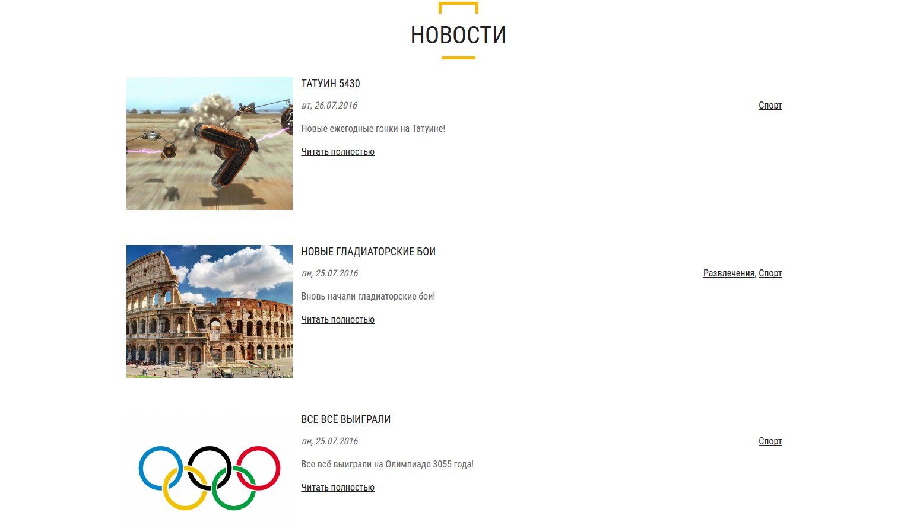

# Новости

Размещение новостей на сайте.

**Скриншоты в конце описания**

* Добавление изображения
* Комментарии
* Рубрики новостей
* Вывод на главную страницу

Требуемые модули от SL7:
* [sl7_control_panel](https://github.com/SemyonDragunov/sl7_control_panel)

Для Drupal 7. PHP >= 5.4 & 7.

Для продолжения разработки css смотрите bower.json

Автор: Семён Драгунов [sam.dragunov@gmail.com](sam.dragunov@gmail.com)

Apache License 2.0

Если необходима английская версия модуля, пишите **@SemyonDragunov**

***
# News

Placing news on the site.

**Screenshots at the end of the this description**

* Add an image
* Comments
* News categories
* Output to the main page

Required modules from SL7:
* [sl7_control_panel](https://github.com/SemyonDragunov/sl7_control_panel)

For Drupal 7. PHP >= 5.4 & 7.

To continue developing css, see bower.json

Author: Semyon Dragunov [sam.dragunov@gmail.com](sam.dragunov@gmail.com)

Apache License 2.0

If you need an English version of the module, write to user **@SemyonDragunov**

***

